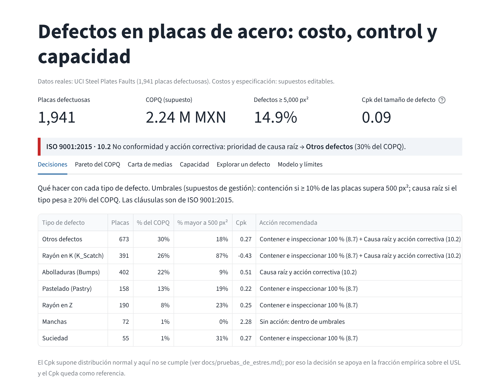
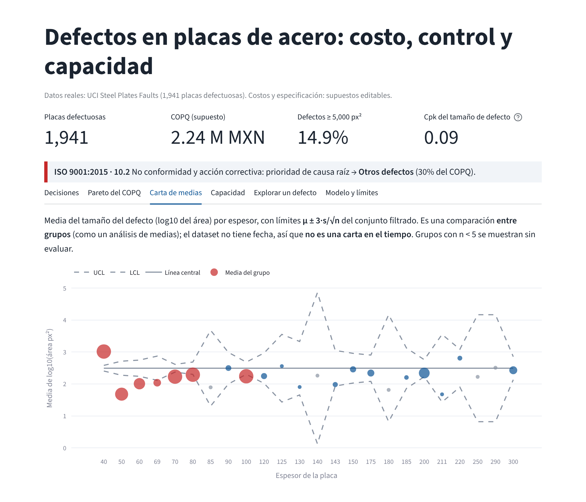

# Inteligencia de manufactura: defectos en placas de acero

**Un sistema de decisión para calidad: qué defectos contener, a cuáles buscarles causa raíz y qué tan confiable es cada conclusión.**

Power BI (DAX, Power Query M) · Python (pandas) · SQL (DuckDB) · Streamlit · control estadístico · COPQ · ISO 9001

> **Datos reales, con límites claros.** Usa *Steel Plates Faults* de UCI: 1,941 placas **con defecto**. No trae placas buenas, fechas, máquinas, turnos ni costos. Por eso: el COPQ usa costos **supuestos** editables, la carta compara **grupos** (no es una carta en el tiempo) y el límite de especificación del tamaño de defecto es **supuesto**. Nada de eso se inventó sobre el dato: está rotulado donde aparece.

## La decisión que habilita

Un gerente de calidad con presupuesto limitado necesita saber dónde actuar primero. El tablero convierte los datos en una regla con umbrales y cita la cláusula de ISO 9001:2015 que respalda cada acción:

| Señal | Umbral (supuesto de gestión) | Acción | ISO 9001:2015 |
|---|---|---|---|
| ≥ 10 % de las placas con defecto mayor a 500 px² | `UMBRAL_FUERA_USL_PCT` | Contener: segregar e inspeccionar al 100 % | 8.7 Control de salidas no conformes |
| Un tipo pesa ≥ 20 % del COPQ | `UMBRAL_COPQ_PCT` | Análisis de causa raíz y acción correctiva | 10.2 No conformidad y acción correctiva |
| Cpk < 1.00 sin otra señal | Referencia, no criterio único | Vigilar y evaluar | 9.1.3 Análisis y evaluación |

Los umbrales viven en `qbi/config.py` y en `powerbi/dax/measures.dax` (`Accion Recomendada`).



## Resumen ejecutivo

**Con costos ilustrativos, los defectos suman 2.24 millones de MXN. Tres tipos concentran el 78 % del costo, y el rayón en K es el que más daña: 20 % de las placas, pero 267 de los 289 defectos grandes (≥ 5,000 px²).**

| Hallazgo | Evidencia |
|---|---|
| El costo se concentra en pocos tipos | Otros defectos, rayón en K y abolladuras suman 77.7 % del COPQ supuesto |
| El rayón en K es el defecto grande | Área mediana 6,281 px² frente a 16–209 px² de los demás; es el 92 % de los defectos ≥ 5,000 px² |
| Está confinado a un acero y un espesor | 99.7 % en acero A400 y 99 % en espesor 40 |
| El espesor 40 pesa 42 % del COPQ | 710 de 1,941 placas |
| Solo las manchas están dentro de umbrales | 0 % de las placas supera 500 px²; las demás activan contención, causa raíz o ambas |



## Qué tan confiable es cada conclusión

Detalle y código en [`docs/pruebas_de_estres.md`](docs/pruebas_de_estres.md).

| Conclusión | Prueba | Resultado |
|---|---|---|
| Tres tipos concentran el costo | Costos variados ±30 % al azar, 2,000 veces | El mismo trío queda arriba en 99 % de los casos |
| El rayón en K es el número uno en costo | Misma simulación | **No resiste**: encabeza en 27 %. Se afirma el trío, no el primer lugar |
| El proceso no es capaz | Límite de especificación de 200 a 5,000 px² | Cpk global entre −0.08 y 0.51: siempre bajo 1.00 |
| El Cpk es válido | Shapiro-Wilk por tipo | **No**: ninguna distribución es normal. La decisión usa la fracción empírica sobre el límite |
| El espesor explica los grupos fuera de límites | Misma carta sin rayón en K y solo en abolladuras | De 7 de 19 baja a 4 de 19 y a 1 de 9: gran parte es el tipo de defecto |

## Trazabilidad entre dato, medida y norma

| Dato / medida | Medida DAX | Cláusula |
|---|---|---|
| Placas con defecto mayor al límite | `% Fuera de USL` | 8.7 |
| Costo por tipo y Pareto | `COPQ MXN`, `COPQ Acumulado %` | 10.2, 9.1.3 |
| Límites de control por grupo | `UCL`, `LCL`, `Fuera de Limites` | 9.1.1 Seguimiento y medición |
| Capacidad | `Cpk`, `Semaforo Cpk Color` | 9.1.1 (referencia) |
| Regla de decisión | `Accion Recomendada`, `Texto ISO 10.2` | 8.7, 10.2 |

## Qué contiene

| Entregable | Dónde |
|---|---|
| Esquema estrella (1 hecho, 3 dimensiones) | `data/model/`, diagrama en `docs/diccionario_de_datos.md` |
| ETL reproducible | `etl/build_star_schema.py` |
| Consultas Power Query M (unpivot, uniones, columnas condicionales) | `powerbi/powerquery/` |
| Medidas DAX | `powerbi/dax/measures.dax` |
| Tema de Power BI | `powerbi/theme.json` |
| Tablero equivalente en Streamlit | `streamlit_app.py` |
| Diccionario de datos y mapeo de terminología | `docs/diccionario_de_datos.md` |
| Pruebas de estrés y errores corregidos | `docs/pruebas_de_estres.md` |
| Guía para armar el .pbix en Windows | `docs/construir_en_power_bi.md` |
| 16 pruebas automáticas | `tests/` |

## Método

1. **Datos.** El CSV público se convierte en un esquema estrella. Cada placa tiene un solo tipo de defecto (se verifica); las siete columnas indicadoras se pasan a una dimensión.
2. **COPQ.** Costo por placa afectada según el tipo de defecto, tomado de una tabla editable. Pareto por costo, con porcentaje acumulado.
3. **Carta de medias por espesor.** Media del log10 del área con límites **μ ± 3·s/√n**. Es una comparación entre grupos. El archivo viene ordenado por tipo de defecto, así que `id` no es una secuencia y una carta en el tiempo sería un artefacto.
4. **Capacidad.** Cpk unilateral superior del tamaño del defecto (en log10), con semáforo: verde ≥ 1.33, amarillo ≥ 1.00, rojo debajo. Es referencia: no se cumple la normalidad.
5. **Validación cruzada.** Cada medida existe en tres formas: DAX, Python y SQL en DuckDB. Las pruebas exigen que Python y SQL den el mismo resultado.

## Cómo ejecutarlo

```bash
python -m venv .venv
.venv\Scripts\activate            # Windows · en macOS/Linux: source .venv/bin/activate
pip install -r requirements-dev.txt

python -m etl.build_star_schema    # regenera data/model/
python -m tools.stress_tests       # regenera docs/pruebas_de_estres.md
pytest                             # 16 pruebas
streamlit run streamlit_app.py
```

Para el tablero en Power BI, sigue `docs/construir_en_power_bi.md`.

## Power BI

- Proyecto PBIP versionado en [`powerbi/project/`](powerbi/project/).
- Artefacto ejecutable PBIX en [`powerbi/artifacts/`](powerbi/artifacts/): [`steel-plates-quality-bi.pbix`](powerbi/artifacts/steel-plates-quality-bi.pbix).
- El PBIX se gestiona con Git LFS. Para descargar sus bytes después de clonar: `git lfs pull`.

```text
POWER BI ARTIFACTS: AVAILABLE
POWER BI VALIDATION: PENDING
```

El parámetro `RutaCSV` del PBIP apunta a la URL pública del CSV en este repositorio, así que el proyecto se actualiza en cualquier equipo con conexión. Para trabajar sin conexión, cámbialo en Power BI Desktop a la ruta local de `data/raw/steel_plates_faults.csv`.

## Limitaciones

- **Validación en Power BI Desktop pendiente.** Los artefactos PBIP y PBIX están disponibles. La ejecución y comprobación de los gates G1–G5 de [`docs/construir_en_power_bi.md`](docs/construir_en_power_bi.md) sigue pendiente de evidencia; disponer de los archivos no acredita la validación analítica.
- **Sin tiempo, máquina ni turno.** No hay carta de control temporal ni % de scrap. En `measures.dax` queda comentado el patrón de rango móvil para cuando existan fechas.
- **Confusión entre espesor y tipo de defecto.** El 99 % del rayón en K cae en espesor 40.
- **Costos, límite de especificación y umbrales de acción supuestos.** Cámbialos con los de tu planta; el orden del Pareto depende de ellos.
- **Familias de defecto** (Superficie, Forma, Otros): agrupación del analista.

---

**Jesús R. L. González**: Analista y Científico de Datos · Operaciones y Calidad en manufactura · [LinkedIn](https://www.linkedin.com/in/jesus-r-l-gonzalez)

*Datos: Steel Plates Faults, UCI Machine Learning Repository (Semeion). Revisa su licencia y cita en la página del dataset.*
