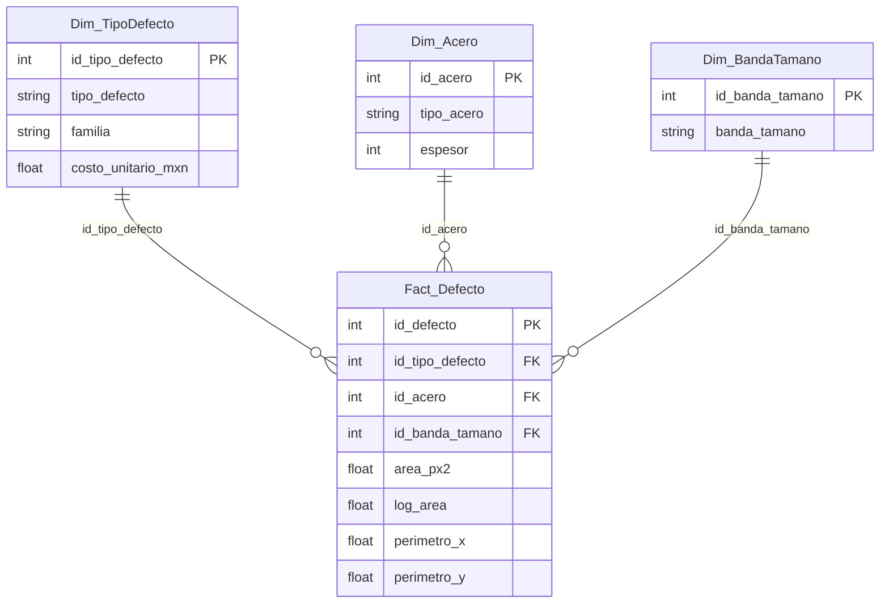

# Diccionario de datos y mapeo de terminología

**Fuente:** *Steel Plates Faults*, UCI Machine Learning Repository (donantes: Semeion, Research Center of Sciences of Communication). 1,941 placas, 27 variables de diagnóstico y 7 indicadores de defecto. Archivo: `data/raw/steel_plates_faults.csv`. Consulta la licencia y la cita oficial en la página del dataset en UCI.

## Qué es una fila
Una placa de acero **con defecto**. Cada placa tiene exactamente un tipo de defecto (se verifica en las pruebas). No hay placas buenas, fechas, máquinas, turnos ni costos.

## Mapeo a la terminología de scrap
| Dataset (UCI) | Este proyecto | Familia (agrupación del analista) |
|---|---|---|
| `Pastry` | Pastelado | Superficie |
| `Z_Scratch` | Rayón en Z | Superficie |
| `K_Scatch` | Rayón en K | Superficie |
| `Stains` | Manchas | Superficie |
| `Dirtiness` | Suciedad | Superficie |
| `Bumps` | Abolladuras | Forma |
| `Other_Faults` | Otros defectos | Otros |

La familia es una agrupación mía para el análisis, no viene en el dataset.

## Esquema estrella

Relaciones uno a muchos, filtro de dimensión a hecho. No existe `Dim_Tiempo`, `Dim_Maquina` ni `Dim_Turno` porque el dataset no tiene esos datos.

## Columnas del modelo
| Tabla | Columna | Origen | Nota |
|---|---|---|---|
| Fact_Defecto | `id_defecto` | `id` | Orden de archivo; **no** es secuencia de producción (el archivo viene ordenado por tipo de defecto) |
| | `area_px2` | `Pixels_Areas` | Área del defecto en píxeles |
| | `log_area` | `LogOfAreas` | log10 del área; es la variable de la carta y del Cpk |
| | `perimetro_x/y` | `X_Perimeter`, `Y_Perimeter` | |
| | `luminosidad_suma/min/max` | `Sum_/Minimum_/Maximum_of_Luminosity` | |
| | `longitud_transportador` | `Length_of_Conveyer` | |
| | `indice_bordes/vacio/luminosidad` | `Edges_/Empty_/Luminosity_Index` | |
| Dim_Acero | `tipo_acero` | `TypeOfSteel_A300/A400` | A300 si el indicador A300 es 1, si no A400 |
| | `espesor` | `Steel_Plate_Thickness` | Unidad no especificada en el dataset |
| Dim_BandaTamano | `banda_tamano` | derivado de `Pixels_Areas` | Cortes en 50, 200, 1,000 y 5,000 px² |
| Dim_TipoDefecto | `costo_unitario_mxn` | **supuesto** | Costo por placa afectada; reemplazar con datos de planta |

Las 17 variables de geometría y forma restantes del dataset original no se cargan al modelo: no se usan en las medidas.
